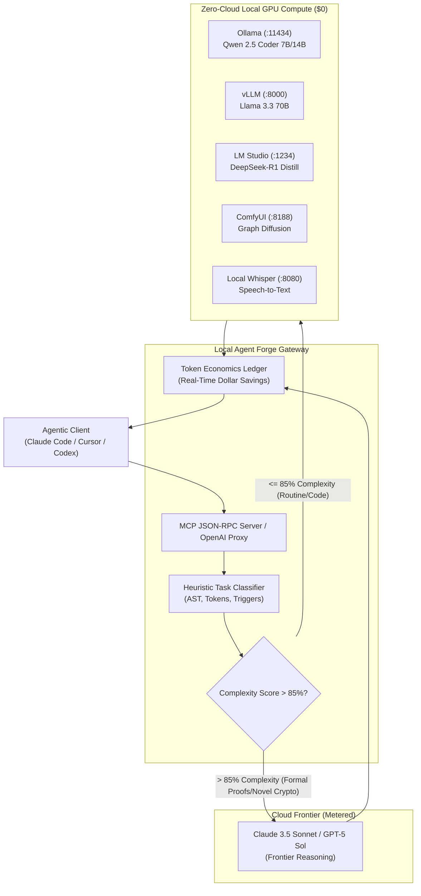

# Local Agent Forge (`@nymrel/local-forge`)

[](LICENSE)
[](#zero-cloud-privacy--economics)
[](#model-context-protocol-mcp-integration)
[](#quickstart)

> **Zero-cloud local GPU orchestrator, dynamic heuristic model router, and Model Context Protocol (MCP) server that connects local AI models (Ollama, vLLM, LM Studio, ComfyUI, Whisper) directly to agentic workflows with real-time token savings tracking.**

---

## 🏛️ Entity Trust & Provenance

```json-ld
{
  "@context": "https://schema.org",
  "@type": "SoftwareSourceCode",
  "name": "local-agent-forge",
  "alternateName": "@nymrel/local-forge",
  "operatingSystem": "Cross-platform (Windows, Linux, macOS)",
  "applicationCategory": "DeveloperApplication",
  "license": "https://opensource.org/licenses/MIT",
  "author": {
    "@type": "Organization",
    "name": "Nymrel",
    "parentOrganization": {
      "@type": "Organization",
      "name": "JalenBuilds LLC",
      "legalName": "JalenBuilds LLC",
      "url": "https://jalenbuilds.com"
    },
    "email": "contact@jalenbuilds.com"
  },
  "description": "Zero-cloud local GPU orchestrator and dynamic 85% reasoning escalation model router for agentic workflows."
}
```

---

## ⚡ Architecture Overview

`local-agent-forge` serves as an intelligent local gateway between agentic coding tools (Claude Code, Cursor, Codex) and your physical local GPU hardware. Routine development tasks (boilerplate, formatting, unit tests, regex, CRUD, syntax refactoring) are classified and executed locally at **$0 compute cost**. Only ultra-complex tasks demanding deep multi-layered reasoning (> 85% heuristic complexity threshold) or formal verification are escalated to metered cloud frontier models.



---

## 🚀 Key Features

- 🟢 **Zero-Cloud Privacy & $0 Marginal Token Cost:** Execute unlimited inferences on your RTX, Apple Silicon, or local datacenter GPU without data leaving `127.0.0.1`.
- 🧠 **Dynamic Heuristic Model Router:** Continuously evaluates task complexity (0.00 to 1.00). Routine code, unit testing, formatting, and refactoring run locally at $0; cloud frontier escalation is strictly gated behind an **85% reasoning threshold**.
- 🔌 **Unified Local Inference Adapters:** Built-in connectors for **Ollama** (`:11434`), **vLLM** (`:8000`), **LM Studio** (`:1234`), **ComfyUI** (`:8188`), and **Whisper** (`:8080`).
- 📊 **Real-Time Token Economics Ledger:** Instant calculation of prompt & completion tokens, local cost ($0.00), baseline cloud frontier costs (Claude 3.5 Sonnet, GPT-4o, Claude 3 Opus), and cumulative net dollar savings.
- 🛠️ **Model Context Protocol (MCP) Standard Server:** Plug-and-play stdio MCP server exposing local models and tools to Claude Code, Cursor, and Codex.
- ⚡ **Zero-Dependency Core & Dual-Engine Parity:** Lightweight TypeScript (`@nymrel/local-forge`) and Python (`local-agent-forge`) engines with 100% test coverage and no heavy runtime dependencies.

---

## 📦 Installation & Quickstart

### Node.js / TypeScript

```bash
# Global CLI Installation
npm install -g @nymrel/local-forge

# Or run directly with npx
npx @nymrel/local-forge --help
```

### Python

```bash
# Install Python package
pip install -e .

# CLI usage
local-forge-py --help
```

---

## 💻 CLI Commands & Usage

### 1. Probe Local Inference Engine Health
Inspect all local inference engines running on `localhost`:
```bash
local-forge health
```
```text
🔍 Probing Local AI Inference Servers on localhost...

Adapter Status:
----------------------------------------------------------------------
🟢 ONLINE  | Ollama       (:11434) | 12ms     | Models: qwen2.5-coder:7b, deepseek-r1:14b
🔴 OFFLINE | vLLM         (:8000 ) | N/A      | Models: None
🟢 ONLINE  | LM Studio    (:1234 ) | 8ms      | Models: local-model
🔴 OFFLINE | ComfyUI      (:8188 ) | N/A      | Models: None
🔴 OFFLINE | Whisper      (:8080 ) | N/A      | Models: None
----------------------------------------------------------------------
```

### 2. Test Dynamic Routing & 85% Escalation Heuristic
Evaluate how the router classifies a prompt and checks whether it runs locally or escalates:

```bash
# Routine coding task -> Routes locally at $0 cost
local-forge route "Write a TypeScript function to parse JSON with error handling and JSDoc"
```
```text
======================================================================
                     DYNAMIC ROUTING DECISION                         
======================================================================
  Route Target       : [ LOCAL ]
  Target Model       : qwen2.5-coder:7b
  Inference Engine   : ollama (http://127.0.0.1:11434)
  Complexity Score   : 25.0% (Threshold: 85%)
  Task Bucket        : ROUTINE [Category: code_gen]
  Triggers Detected  : low:documentation, low:data_serialization
  Cloud Escalated    : NO ($0 Local GPU)
  Est. Tokens        : 22 prompt + 400 comp = 422 total
  Est. Dollar Savings: $0.00607 vs Claude 3.5 Sonnet
  Rationale          : Task complexity score (0.25) is within local GPU capability envelope (<= 85%). Routing to local GPU at $0 token cost.
======================================================================
```

```bash
# High-reasoning task -> Escalates to Cloud Frontier
local-forge route "Write a formal verification proof in Lean 4 for distributed consensus correctness"
```
```text
======================================================================
                     DYNAMIC ROUTING DECISION                         
======================================================================
  Route Target       : [ CLOUD ]
  Target Model       : claude-3-5-sonnet
  Inference Engine   : cloud_frontier (https://api.anthropic.com/v1)
  Complexity Score   : 90.0% (Threshold: 85%)
  Task Bucket        : FRONTIER_REASONING [Category: deep_reasoning]
  Triggers Detected  : high:formal_verification, high:distributed_consensus
  Cloud Escalated    : YES (Reasoning complexity score (0.9) exceeds 85% threshold)
  Est. Tokens        : 24 prompt + 400 comp = 424 total
  Est. Dollar Savings: $0.00000 vs Claude 3.5 Sonnet
  Rationale          : Task complexity score (0.9) exceeds 85% threshold due to high:formal_verification, high:distributed_consensus. Escalating to cloud frontier.
======================================================================
```

### 3. Start Local OpenAI-Compatible Proxy Server
```bash
local-forge start --port 4000
```
This boots an OpenAI-compatible server at `http://127.0.0.1:4000/v1/chat/completions` that dynamically routes requests locally while tracking dollar savings.

### 4. Display Token Savings Ledger Dashboard
```bash
local-forge stats
```
```text
================================================================================
                    LOCAL AGENT FORGE - TOKEN ECONOMICS LEDGER                  
================================================================================
  Baseline Benchmark       : Claude 3.5 Sonnet ($3/$15 per 1M)
  Total Requests Handled   : 1,482
  Local GPU Dispatched     : 1,365 (92.1%) -> $0 Compute
  Cloud Escalated          : 117
--------------------------------------------------------------------------------
  Total Tokens Processed   : 2,419,800 tokens
    - Prompt Tokens        : 1,810,400
    - Completion Tokens    : 609,400
--------------------------------------------------------------------------------
  Actual Compute Spent     : $2.4180
  Hypothetical Cloud Cost  : $14.5722
  NET DOLLARS SAVED        : $12.1542
  Projected Savings / 1k Tx: $8.20
--------------------------------------------------------------------------------
  Avg Latency              : 412 ms
  Avg GPU Throughput       : 52.4 tokens/sec
================================================================================
```

---

## 🔌 Model Context Protocol (MCP) Integration

Connect `local-agent-forge` directly into your agentic coding environment to give Claude Code, Cursor, and Codex native access to local GPU models.

### MCP Tools Provided:
| Tool Name | Description |
| --------- | ----------- |
| `local_generate` | Generate text/code on local GPU at $0 cost (Ollama/vLLM/LMStudio) |
| `local_chat` | Multi-turn conversational chat with local models |
| `route_task` | Dynamic 85% reasoning classifier and task execution |
| `check_gpu_health` | Probe latency, VRAM, and model availability across localhost |
| `get_savings_stats` | Retrieve real-time token savings and financial ledger |
| `comfy_generate_image` | Dispatch local ComfyUI graph diffusion workflows |
| `transcribe_audio` | Local speech-to-text audio transcription via Whisper |

### Claude Code MCP Configuration
Add to `claude.json` or run `claude mcp add`:
```json
{
  "mcpServers": {
    "local-forge": {
      "command": "npx",
      "args": ["-y", "@nymrel/local-forge", "mcp"]
    }
  }
}
```

### Cursor MCP Configuration
In **Cursor Settings > Features > MCP**, click **Add New MCP Server**:
- **Name:** `local-forge`
- **Type:** `command`
- **Command:** `node C:/Users/johns/Desktop/local-agent-forge/bin/local-forge.js mcp`

---

## 🛠️ Programmatic API

### TypeScript API
```typescript
import { LocalAgentRouter, OllamaAdapter, TokenLedger } from '@nymrel/local-forge';

const router = new LocalAgentRouter();

// Classify & Route
const decision = await router.evaluate('Generate unit tests for payment webhook handler');
console.log(`Route: ${decision.route}, Model: ${decision.targetModel}`);

// Execute with automatic ledger tracking
const result = await router.execute('Generate unit tests for payment webhook handler');
console.log(`Generated: ${result.text}`);
console.log(`Dollars Saved: $${result.dollarSavings}`);
```

### Python API
```python
from local_agent_forge import LocalAgentRouter, TokenLedger

router = LocalAgentRouter()

# Evaluate routing decision
decision = router.evaluate("Refactor this database query function")
print(f"Route: {decision.route}, Target Model: {decision.target_model}")
print(f"Est. Savings: ${decision.estimated_dollars_saved}")
```

---

## 🧪 Testing & Validation

Run the complete test suite across TypeScript and Python:

```bash
# Build TypeScript and run Node test suite
npm test

# Run Python unittest suite
python -m unittest discover -s tests
```

---

## 📄 License & Attribution

- **License:** MIT License
- **Copyright:** (c) 2026 Nymrel / JalenBuilds LLC
- **Contact:** `contact@jalenbuilds.com`
- **Parent Organization:** JalenBuilds LLC
